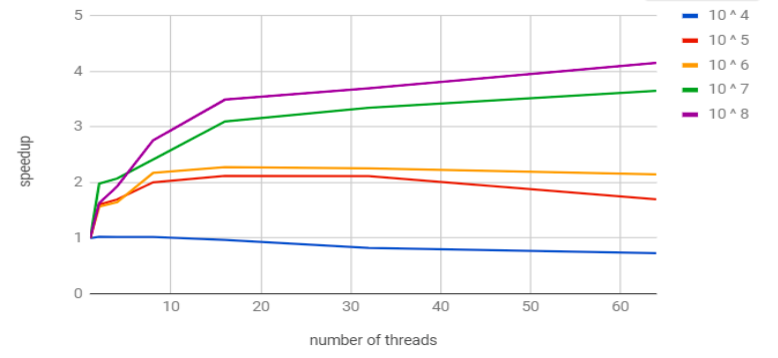
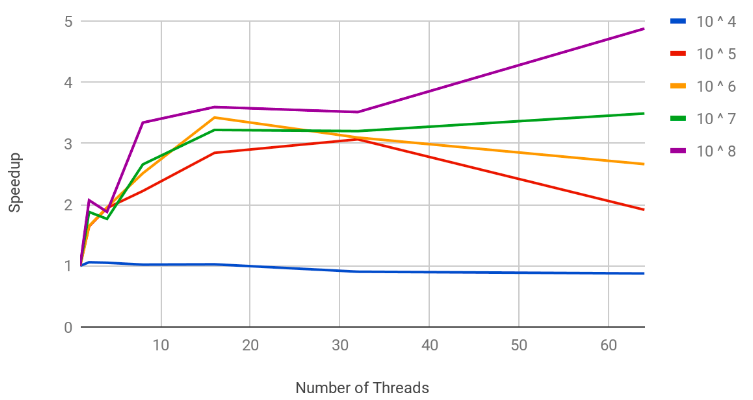
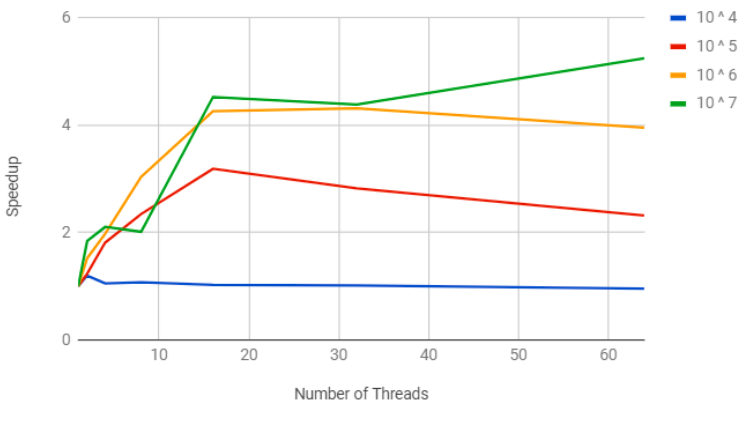

# ParallelEdgeReverse

## Aim

- Parallelizing edge reversal in directed sparse graph using divide and conquer technique in PRAM shared memory model to achieve speedup and scalability.

## Approach

- Graphs are frequently represented as matrices, hence the problem of reversing the edges of an undirected graph can be reduced to transposition of its adjacency matrix. Since the graph is sparse, the matrix will also be sparse. For large input sizes, matrix is an extremely data intensive way of representing a graph, hence a Compressed Sparse Row representation is chosen instead.

## CSR representation

- In CSR format a sparse graph is represented using 3 lists. Let N be the dimension of the matrix representing the graph, (N = |V|) while NNZ be the number of non-zero elements. (NNZ = |E|).
- First list is of size N+1 and is defined as the cumulative sum of elements at each row. It is called csrRowPtr.
- The second list is of size NNZ and contains the column index of each nonzero element encountered while traversing row-wise, it is called as csrColIdx.
- The third list contains Weights of the non-zero elements in the matrix.
- We have implemented CSR as a structure that stores N and NNZ as integers and the csrRowPtr as an integer array. Further the structure has an array of tuples (custom designed struct) where each tuple consists of three elements. Each tuple represents an aggregate of the column index, row index and the weight of the non-zero element.

# Algorithm


- In CSR we traverse in Row-major order and to find the transpose we need to move across the matrix in Column-major order. If we need all elements in their column major order we must first sort according to row index and then sort (stably) according to column index.
- The input matrix already gives us the non-zero elements sorted in column index wise. 
- Thus all that needs to be done is to sort the tuples row-index wise. This would give us the weight and csrRowIdx arrays for output.
- To get the csrRowPtr of the transpose matrix we obtain the frequency of nonzero elements at each column and then obtain it’s prefix sum.


- At the end of the divide and conquer, we get the tuples in order of their column major traversal and the sum of frequency of non-zero elements at each column.
- Now we derive the cumulative frequency of element frequencies at each column.
- This step is parallelised using the parallel prefix sum algorithm.
- Thus we have obtained the three lists we need to get the csr representation of the transpose of the input matrix.
- This output matrix represents the new graph with edges reversed.

## Description

- The input matrix is read and the csr struct filled, except for the row index. Then the row indices of each of the tuples from the csrRowPtr are filled. This step is parallelized using OpenMP for construct.
- Currently the tuples are sorted according to their row indices. If they are sorted according to their column it will be the same as the csr of the transpose of the matrix. (explained later).

## Divide Step

- In this step divide and conquer is performed. The tuple array is successively divided into smaller sub-problems. At each step the tuple array is split into half.

## Base Case

- At the base stage perform two tasks need to be performed. 
	- Firstly the base case tuple array section must be sorted according to their column Index.
	- Secondly an array of N size is populated, by taking each mark and each position with the number of elements belonging to that row in the tuple sub-array. This array is later used to form the csrRowPtr of the output.

## Conquer Step

- Similarly in the Conquer step performed as two tasks :
	- In the conquer step firstly merge sort is performed on the two sorted subarrays. This gives us a larger sorted tuple array. 
	- Secondly two arrays are receive from each of the subproblems of size N and their element wise summation is done and returned.

# Results

- Time is given in seconds

## |E| = 1.1 * |V|


| Number of Threads / Size of input (10 ^ x) | 4 | 5 | 6 | 7 | 8 |
|:---:|:---:|:---:|:---:|:---:|:---:|
| 1 | 0.005667 | 0.054166 | 1.465235 | 11.806843 | 178.860824 |
| 2 | 0.005528 | 0.033767 | 0.933641 | 5.9579708 | 109.777550 |
| 4 | 0.005548 | 0.031947 | 0.889733 | 5.6963188 | 92.573776 |
| 8 | 0.005550 | 0.027 | 0.673478 | 4.886955 | 64.783127 |
| 16 | 0.005847 | 0.025544 | 0.642800 | 3.806756 | 51.202302 |
| 32 | 0.006874 | 0.025595 | 0.649894 | 3.527286 | 48.364526 |
| 64 | 0.007756 | 0.031907 | 0.681595 | 3.234166 | 43.063157 |



## |E| = log(log(|V|))


| Number of Threads / Size of input (10 ^ x) | 4 | 5 | 6 | 7 | 8 |
|:---:|:---:|:---:|:---:|:---:|:---:|
| 1 | 0.020219 | 0.220186 | 1.465235 | 11.806843 | 178.860824 |
| 2 | 0.019107 | 0.133953 | 0.933641 | 5.957971 | 109.777550 |
| 4 | 0.019265 | 0.113280 | 0.889733 | 5.696319 | 92.573776 |
| 8 | 0.019837 | 0.099090 | 0.673478 | 4.886955 | 64.783127 |
| 16 | 0.019738 | 0.077383 | 0.642800 | 3.806756 | 51.202302 |
| 32 | 0.022384 | 0.071816 | 0.649894 | 3.527286 | 48.364526 |
| 64 | 0.023131 | 0.114993 | 0.681595 | 3.234166 | 43.063157 |



## |E| = log(|V|)

| Number of Threads / Size of input (10 ^ x) | 4 | 5 | 6 | 7 | 8 |
|:---:|:---:|:---:|:---:|:---:|:---:|
| 1 | 0.034744 | 0.429355 | 11.270512 | 111.205567 |
| 2 | 0.033965 | 0.295526 | 6.3809791 | 77.7460208 |
| 4 | 0.034999 | 0.373059 | 7.2885537 | 64.5813576 |
| 8 | 0.034161 | 0.256973 | 4.7505816 | 50.6707178 |
| 16 | 0.034721 | 0.216287 | 3.919489 | 39.038489 |
| 32 | 0.036877 | 0.233413 | 4.335653 | 36.294254 |
| 64 | 0.040384 | 0.282911 | 5.050796 | 31.816128 |



## Analysis

- We have tested out algorithm on a 48 core cluster and in all our results we have been able to demonstrate significant scalability for inputs of sufficient size upto 32 threads.
- For smaller inputs the thread overheads outweigh the benefits of using multiple threads and thus 10 ^ 4 fails to show speedup. For all other input sizes we can show speedup.
- Another observation we can make is that greater is the density of the matrix better is our speedup. This can be demonstrated by the fact that the highest speedup is obtained at table 4.

## Compilation and Running

- For compiling the code
	- `make compileAll`
- For running the program on `num` threads
	- `make run t=num`
- For generating the testcase of order `order` and `sparsity`
	- `make testcase v=order e=sparsity`
	- order = 0 : 10 ^ 1; 1 : 10 ^ 2; 2 : 10 ^ 4; 3 : 10 ^ 6; 4 : 10 ^ 8; 5 : 10 ^ 10
	- sparsity = 0 : 1.1 * v; 1 : log(log(v)); 2 : log(v)/2; 3 : log(v)
- Example
```bash
	$ make compile
	$ make testcase d=2 e=2
	$ make run t=8
```

## Underlying Architecture

- The program was thoroughly tested and optimized for a PRAM shared memory model which internally uses pThreads as primary units of computations.

# Dependencies

- gcc 5.4.0
- OpenMP Threads

# Authors

- [Abhishek V Joshi](https://github.com/jbnerd)
- [Shyamal Vaderia](https://github.com/svaderia)
- [Arka Talukdar](https://github.com/atalukdar)

